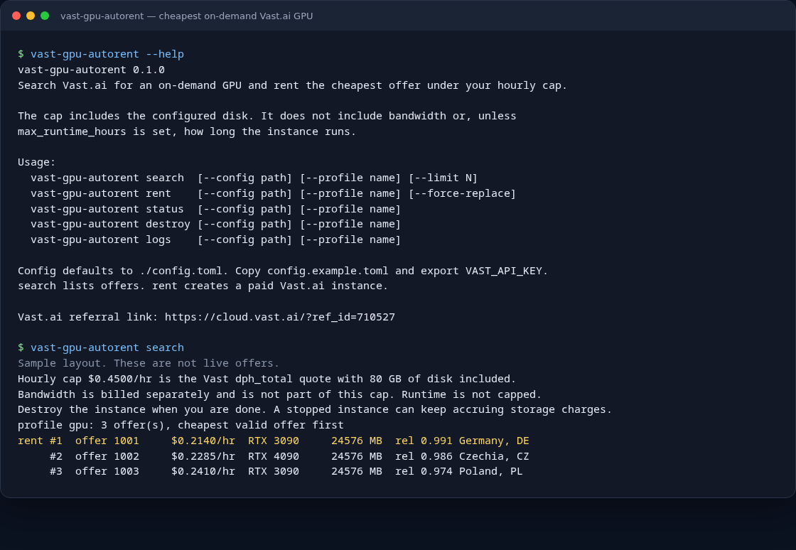

# Vast GPU Auto-Rent

Rust command-line tool that searches [Vast.ai](https://cloud.vast.ai/?ref_id=710527) and rents the cheapest on-demand GPU under an hourly price cap.

`search` only lists offers. `rent` creates a real instance and charges the Vast.ai account that owns `VAST_API_KEY`.

**Vast.ai referral link:** [https://cloud.vast.ai/?ref_id=710527](https://cloud.vast.ai/?ref_id=710527)



The picture shows real `--help` output. The search table under it is a sample layout, not a live quote.

## What it is for

Use this when you want a small CLI to:

- find the lowest `$/hour` on-demand Vast.ai GPU that still meets your filters
- include the disk you will actually request in that hourly quote
- rent one machine, remember it, and avoid starting a second one by accident
- destroy it when you are done, including after a crash or a failed startup

The hourly cap is Vast's `dph_total` quote with your configured disk (`allocated_storage`) included. Bandwidth is billed separately. Runtime is not capped unless you set `max_runtime_hours`.

## Install

You need Rust 1.80 or newer.

```bash
git clone https://github.com/Epsil0nIl/vast-gpu-autorent.git
cd vast-gpu-autorent
cargo build --release
./target/release/vast-gpu-autorent --help
```

## Quick start

1. Create a Vast.ai account: [https://cloud.vast.ai/?ref_id=710527](https://cloud.vast.ai/?ref_id=710527)
2. Create an API key in the Vast console.
3. Copy the example config and point it at the image you want on the GPU.

```bash
cp config.example.toml config.toml
export VAST_API_KEY="your vast api key"
./target/release/vast-gpu-autorent search
./target/release/vast-gpu-autorent rent
./target/release/vast-gpu-autorent status
./target/release/vast-gpu-autorent destroy
```

Leave `vast.api_key` empty in the file. `config.toml` and `state/` are gitignored so a real key or instance address is not committed.

`rent` spends money. Run `search` first and read the hourly cap it prints.

## Commands

| Command | What it does |
| --- | --- |
| `search` | Lists matching on-demand offers, cheapest valid offer first. Does not rent. |
| `rent` | Creates one instance. Refuses if this profile already has a lease. |
| `rent --force-replace` | Destroys the current instance, then rents another. |
| `status` | Refreshes the recorded instance from Vast.ai. |
| `destroy` | Deletes the Vast.ai instance and clears the local lease. |
| `logs` | Asks Vast.ai for the instance log URL. |

Flags: `--config path`, `--profile name`, `--limit N`.

## How the cheapest offer is chosen

1. `POST /bundles/` for rentable, unrented, on-demand machines.
2. The request sends `allocated_storage` and `disk_space >= disk_gb` using the same disk size the create call will use, so the `$/hour` quote includes that disk.
3. Offers must be under `max_hourly_price_usd`, with enough GPU RAM, enough reliability, and by default a verified host and a direct port.
4. If `preferred_geolocations` is set, each region is queried on its own, in order. The first region with a match wins, then the cheapest offer inside it. Names such as `Germany` are sent as Vast country codes (`DE`). One global page is only the fallback when every region query is empty.
5. Equal price keeps the higher reliability score.
6. Create uses `PUT /asks/{id}/`. If Vast says the offer is already gone (`410` / `no_such_instance` or `no_such_ask`), the next offer is tried.
7. The instance id is written to `state/leases.json` before the ready wait. The next `rent`, `status`, or `destroy` reuses or destroys that instance instead of starting another one.
8. Ready means Vast reports `running` and the SSH port accepts a TCP connection.
9. A file lock covers the check, create, and save, so a second process waits.

Vast measures `gpu_ram` in megabytes. A 24 GB floor is sent as `24576`. Published ports are sent as env keys `-p PORT:PORT=1`, which is the Vast create-instance convention.

Set `max_runtime_hours` if you want the next `rent`, `status`, or `destroy` to tear the instance down after that many hours. A stopped instance can still accrue storage charges, so a machine that never becomes ready is destroyed instead of left stopped.

## Configuration

[`config.example.toml`](config.example.toml) is the starting point.

- `[vast]` is the API host, hourly cap, poll interval, and optional runtime limit. The API host must be `https://console.vast.ai`.
- `[profiles.gpu]` is the GPU count, VRAM floor, disk, image, ports, and optional startup command.
- `[profiles.gpu.env]` is copied onto the instance. Secret-looking values are redacted in debug output.
- `[profiles.gpu.volume]` is optional. Use it only with your own volume id. It pins the search to that machine and points model caches at the mount.

When set, the instance also receives `RENT_LEASE_ID`, `RENT_PROFILE`, `RENT_CALLBACK_URL`, and `RENT_BOOTSTRAP_TOKEN`.

## Safety

- `rent` creates a paid Vast.ai instance.
- Do not commit `VAST_API_KEY`, `config.toml`, or `state/`.
- Destroy the instance when you are done.
- This tool does not cap bandwidth. The hourly number is not a total bill.

## Development

```bash
cargo test
```

Layout:

- `src/select.rs` — filters, region order, cheapest-price pick, create body
- `src/client.rs` — Vast.ai HTTP calls and the SSH readiness check
- `src/rent.rs` — search, rent, wait, destroy, and crash recovery
- `src/lease.rs` — local lease file and the process lock
- `src/main.rs` — CLI

## License

[MIT](LICENSE). Copyright (c) 2026 Epsil0nIl.

The Vast.ai link in this README is a referral link (`ref_id=710527`).
